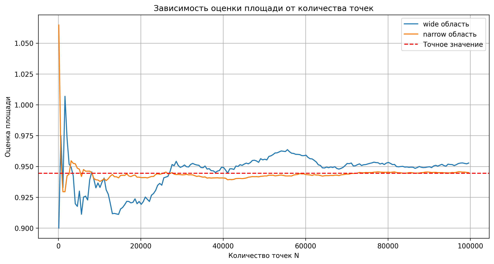

## Структура решения
- `main.cpp` - содержит код для генерации файла с результатами эксперементальных прогонов `results.csv`
- `results.csv` - результаты прогонов в CSV формате
- `images/areas_estimates.png` - График отражающий приближенное значение площади в зависимости от заданных параметров алгоритма
- `images/relative_error.png` - График отражающий относительное отклонение приближенного значения площади от ее точной оценки в зависимости от указанных параметров алгоритма 

## Анализ проведенной деятельности

### Обзор эксперимента

Были проведены эксперименты по оценке площади пересечения трех кругов методом Монте-Карло с использованием двух различных областей генерации точек:

- **Широкая область**: [0.0, 3.0] x [0.0, 3.0]
- **Узкая область**: [0.8, 2.1] x [0.8, 2.1]

Количество случайных точек варьировалось от 100 до 100,000 с шагом 500.

## Основное

### 1. **Точное значение площади**
Точная площадь пересечения составляет **0.944517** единиц².

### 2. **Сходимость оценок**

#### Широкая область:
- **При малых N (100-5000)**: Значительные колебания оценок (от 0.9 до 1.00687)
- **При средних N (5000-30000)**: Стабилизация около 0.95-0.96
- **При больших N (30000-100000)**: Устойчивая оценка около 0.945

#### Узкая область:
- **Быстрая сходимость**: Уже при N ≈ 2000-3000 оценки стабилизируются около точного значения
- **Отклонения**: Значительно меньшие колебания по сравнению с широкой областью

### 3. **Точность оценок**

#### Относительная ошибка по областям:

| Область | N ≈ 1000 | N ≈ 10000 | N ≈ 100000 |
|---------|----------|-----------|------------|
| Широкая | 1.2-6.6% | 0.5-1.5%  | 0.1-0.5%   |
| Узкая   | 0.2-1.6% | 0.05-0.3% | 0.01-0.1%  |

**Ключевой вывод**: Узкая область обеспечивает в **5-10 раз** меньшую ошибку при одинаковом количестве точек.

## Анализ поведения ошибок

### Закономерности уменьшения ошибки:

1. **Эффективность узкой области**:
    - При N = 10,000: относительная ошибка ≈ 0.1%
    - При N = 100,000: относительная ошибка ≈ 0.01%

2. **Стабильность оценок**:
    - Узкая область: плавное уменьшение ошибки
    - Широкая область: заметные колебания даже при больших N

3. **Эффективность подсчета**
- Для достижения точности 0.1%:
- - **Широкая область**: требуется 50,000 точек
- - **Узкая область**: требуется 10,000 точек

- Экономия вычислений: 80%
## Заключение

Метод Монте-Карло доказал свою эффективность для вычисления площадей сложных геометрических фигур, а правильный выбор области генерации оказался **критически важным** фактором, влияющим на точность и эффективность вычислений. Узкая область позволяет достигать требуемой точности при значительно меньших вычислительных затратах.